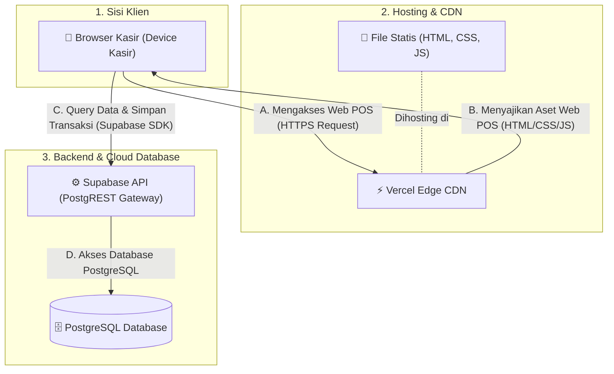
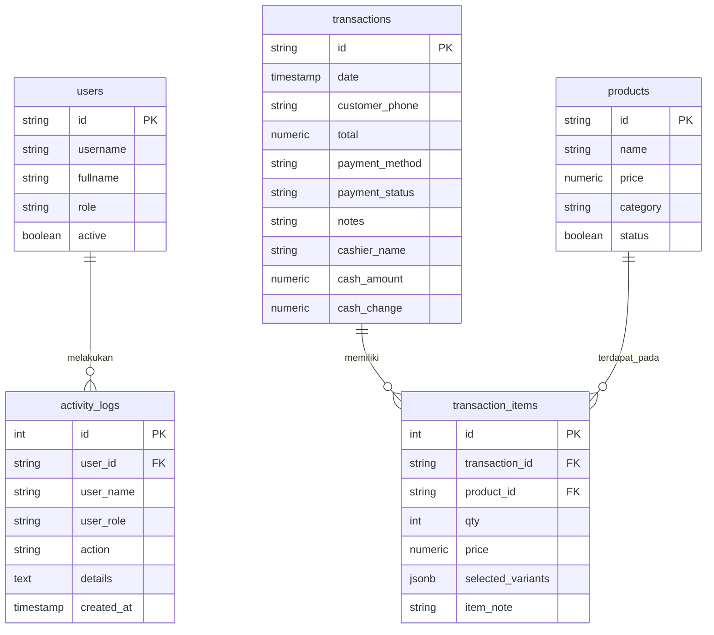
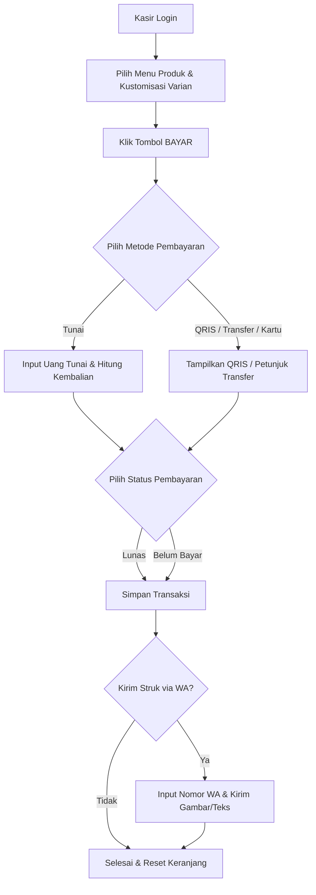

# 📘 Dokumentasi Sistem Point of Sale (POS) - Kopi Sembilan

Dokumen ini menjelaskan arsitektur, skema data, fitur, dan alur operasional dari aplikasi kasir berbasis web (*Point of Sale*) Kopi Sembilan.

---

## ☕ 1. Pengenalan Aplikasi
**Kopi Sembilan POS** adalah aplikasi kasir berbasis web yang dirancang khusus untuk operasional toko atau kafe dengan pendekatan *Mobile-First Design* (responsif dan optimal untuk perangkat tablet/ponsel pintar kasir). Aplikasi ini terintegrasi secara *real-time* dengan cloud database Supabase untuk memastikan sinkronisasi data yang cepat, aman, dan dapat dipantau dari mana saja.

---

## 🛠️ 2. Arsitektur & Tech Stack

Aplikasi dideploy secara statis melalui **Vercel** dan menggunakan BaaS (Backend-as-a-Service) untuk menghemat biaya infrastruktur server:

* **Frontend**: HTML5, Vanilla CSS3 (tanpa framework/Tailwind untuk performa optimal), dan Vanilla Javascript (ES6+) untuk manajemen state (keranjang belanja) dan interaktivitas DOM.
* **Backend & Database**: **Supabase (PostgreSQL)** untuk penyimpanan data terstruktur, otentikasi user, dan penyimpanan log aktivitas kasir secara real-time.
* **Eksternal Library**:
  * **Lucide Icons**: Penyedia ikon vektor yang bersih dan modern di seluruh antarmuka.
  * **html2canvas**: Digunakan untuk menangkap elemen struk kasir di web dan mengubahnya menjadi gambar PNG secara real-time untuk dibagikan.
  * **Flatpickr**: Library selektor tanggal (date picker) untuk kebutuhan filter laporan.

### 🌐 Diagram Arsitektur Sistem

Berikut adalah diagram alur interaksi antara perangkat kasir (Frontend), jaringan hosting Vercel, dan database Supabase:

---

## 📂 3. Struktur Database (Supabase)

Sistem menggunakan database PostgreSQL yang dikelola melalui Supabase dengan 5 tabel utama:

---

## 🚀 4. Fitur Utama Per Menu

Navigasi sidebar membagi aplikasi ke dalam 8 halaman utama yang dapat diakses sesuai dengan role pengguna (Admin/Kasir):

### 📊 A. Dashboard (Ringkasan Performa)
Menampilkan metrik utama kafe yang bersumber langsung dari database Supabase secara real-time:
* **Total Pendapatan**: Jumlah omzet dari semua transaksi berstatus "Lunas".
* **Total Transaksi**: Jumlah transaksi berhasil yang tercatat.
* **Menu Aktif**: Jumlah produk yang terdaftar dan aktif di dalam sistem.

### 🛒 B. Kasir / POS (Point of Sale)
Jantung utama operasional kasir untuk mencatat pesanan pelanggan secara cepat:
* **Kategori Menu**: Filter produk berdasarkan kategori (*Specialty Coffee*, *Regular Coffee*, *Non-Coffee*, *Signature*).
* **Varian & Catatan Produk**: Menambahkan varian khusus (ukuran, suhu, jenis susu) serta catatan khusus (misalnya *"Less Ice"* atau *"No Sugar"*) langsung pada item sebelum masuk keranjang.
* **Manajemen Keranjang**: Menyesuaikan jumlah kuantitas, menambah catatan item, atau menghapus pesanan dari keranjang secara real-time.
* **Metode Pembayaran Fleksibel**:
  * **Tunai (Cash)**: Dilengkapi dengan kalkulator jumlah bayar dan nominal kembalian otomatis.
  * **QRIS (Cashless)**: Menampilkan QR Code statis toko untuk pembayaran digital.
  * **Transfer & Kartu**: Untuk pembayaran debit/kredit dan transfer bank.
* **Kirim Struk WhatsApp**: Checkout transaksi terintegrasi dengan API WhatsApp untuk mengirimkan struk digital berupa teks rangkuman invoice atau **gambar struk (PNG)** yang di-generate langsung dari layar.

### 📦 C. Inventaris (Manajemen Menu)
Menu khusus untuk Admin guna mengelola daftar menu kafe:
* **Tambah & Edit Produk**: Memasukkan produk baru beserta nama, harga dasar, dan kategorinya.
* **Status Aktif (Soft Delete)**: Menonaktifkan produk sementara tanpa menghapus riwayat transaksinya dari database.

### 📈 D. Laporan Penjualan (Reports)
Halaman analisis keuangan dan riwayat penjualan yang komprehensif:
* **Filter Interaktif**: Memfilter data secara detail berdasarkan rentang waktu (**Mulai Tanggal** dan **Akhir Tanggal** terpisah untuk pencarian harian, mingguan, maupun bulanan), Status Pembayaran (Lunas/Belum Bayar), dan Metode Pembayaran.
* **Pengurutan Kolom (Sorting)**: Mendukung pengurutan data tabel secara interaktif dengan mengklik judul kolom **Waktu** (terbaru ↔ terlama) dan kolom **Total** (terbesar ↔ terkecil).
* **Metrik Ringkasan**: Menampilkan total pendapatan bersih, rata-rata nominal per transaksi, dan jumlah transaksi yang masih menunggak pembayaran.
* **Ekspor CSV**: Mengunduh seluruh data riwayat penjualan yang terfilter ke dalam format file Excel/CSV dengan sekali klik.
* **Kirim Ulang & Cetak Struk**: Mengirim ulang struk WhatsApp (Teks/Gambar) untuk transaksi lama langsung dari daftar riwayat.
* **Manajemen Riwayat (Khusus Admin)**: Otoritas penuh bagi admin untuk mengubah detail transaksi (Edit) atau menghapus transaksi (Hapus) yang salah input.

### 👥 E. Kelola Akun (Manajemen Pengguna)
Fitur kontrol akses kasir bagi pemilik/Admin:
* **Tambah Kasir Baru**: Membuat username, nama lengkap, password, dan memilih role (Admin/Kasir).
* **Kontrol Status**: Menonaktifkan akun kasir yang sudah tidak bekerja agar tidak bisa masuk ke dalam sistem kasir kembali.

### ⚙️ F. Pengaturan Toko
Menyesuaikan identitas struk digital dan operasional kafe:
* **Informasi Toko**: Mengubah Nama Toko, Alamat Fisik, dan No. Telepon Resmi Toko (akan tertera di header struk gambar).
* **Template Pesan WhatsApp**: Menyesuaikan susunan teks otomatis yang dikirim ke nomor WhatsApp pelanggan saat checkout.

### 📖 G. Panduan Pengguna
Buku manual interaktif di dalam aplikasi yang menjelaskan langkah-langkah penggunaan fitur POS secara terperinci (termasuk filter rentang tanggal laporan baru, pengurutan kolom total/waktu, dan sistem stabilitas status) untuk memudahkan pelatihan kasir baru.

### 🔔 H. Pop-Up Pembaruan Aplikasi (Changelog)
Notifikasi interaktif pop-up dengan latar belakang buram premium (*backdrop blur*) yang muncul otomatis sekali saja saat membuka aplikasi POS jika terdapat pembaruan versi sistem terbaru. Disediakan pula **Ikon Melayang (Floating Action Button)** di pojok kanan bawah layar untuk menampilkan kembali modal pembaruan ini kapan saja (tombol ini disembunyikan secara otomatis di halaman Login demi menjaga kerapian antarmuka awal).

### 🛡️ I. Log Aktivitas (Audit Logs)
Fitur keamanan untuk mencatat audit aktivitas sistem. Setiap tindakan penting (seperti masuk sistem, menambah produk, mengedit transaksi, atau menghapus data) dicatat lengkap dengan nama kasir, tanggal, dan detail perubahannya demi meminimalkan kecurangan internal.

---

## 🔄 5. Alur Kerja Transaksi Kasir (User Flow)

Berikut adalah alur standar ketika kasir melayani transaksi pembelian:

---

## 🔒 6. Fitur Keamanan dan Toleransi Kesalahan (Fault Tolerance)

* **Deteksi Gangguan Status**: Jika terjadi masalah di browser kasir (misalnya crash cache/autofill) yang dapat menyebabkan status pembayaran kosong, sistem secara otomatis mengamankannya dengan *fallback* status bawaan `"Lunas"`.
* **Koneksi Supabase**: Menggunakan API Client Key Supabase yang aman untuk transaksi data tanpa mengekspos database internal secara langsung.
* **Audit Trail**: Segala bentuk kecurangan seperti penghapusan transaksi atau modifikasi harga produk akan terekam secara otomatis di log aktivitas admin dan tidak dapat dihapus dari panel web.
* **Transisi Halaman Mulus (UX Transition)**: Setiap perpindahan menu menggunakan animasi *fade-in-up* berbasis CSS Keyframes dengan kurva bezier kustom untuk menyajikan perpindahan halaman yang halus, modern, dan interaktif.
* **Cadangan Otomatis Cloud (Auto-Backup)**: Sistem mendukung pencadangan bulanan otomatis ke Google Drive dalam format Google Sheets yang rapi, ber-filter, berzona waktu WIB akurat, dan memiliki tab sheet **"Ringkasan"** keuangan dinamis. Tuntunannya tercatat lengkap di [PANDUAN_AUTOBACKUP.md](file:///c:/Users/ASUS/kopisembilan/PANDUAN_AUTOBACKUP.md).
