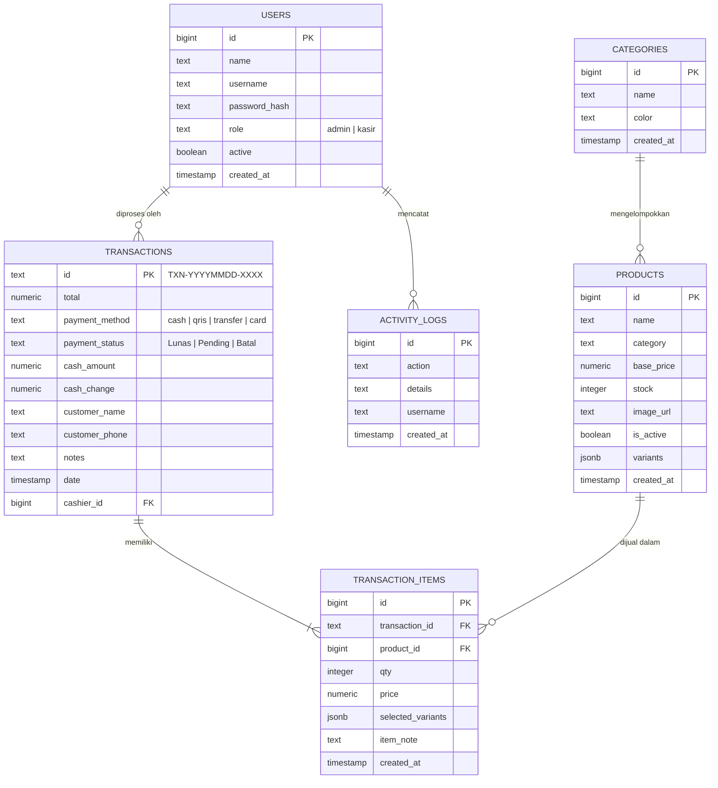
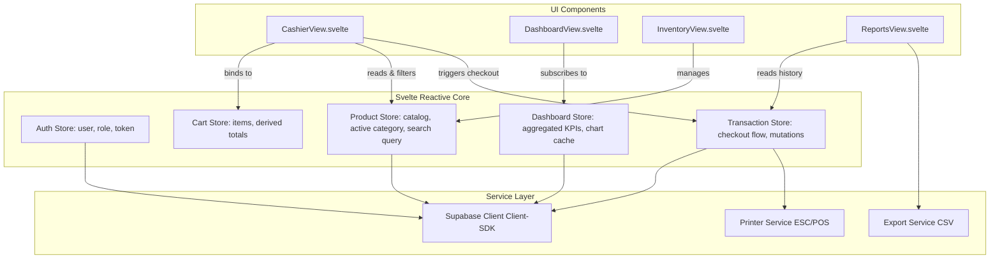

# DOKUMEN PEMETAAN ARSITEKTUR DATA & STATE (DATA & STATE MAPPING)
## Rekayasa Ulang Aplikasi Point of Sale (POS) Toko Kopi Sembilan: Vanilla JS ke Svelte

---

**Tanggal:** 22 September 2026  
**Dokumen:** Spesifikasi Desain Arsitektur Perangkat Lunak (Software Architecture Design Specification)  
**Tujuan:** Memetakan seluruh entitas basis data, variabel *global state*, serta siklus hidup (*lifecycle*) antarmuka sistem eksisting berbasis Vanilla JS ke dalam arsitektur komponen reaktif modern berbasis Svelte.

---

## 1. Pemetaan Entitas Basis Data (Supabase)

Sistem POS Toko Kopi Sembilan berinteraksi dengan 6 tabel utama pada Supabase:



---

## 2. Analisis Keterbatasan *State Management* Sistem Eksisting (Vanilla JS)

Pada implementasi lama (`js/scripts.js`), seluruh *state* aplikasi disimpan dalam variabel global di *window scope*:

```javascript
// Global State Lama (Vanilla JS):
let currentUser = null;
let cart = [];
let products = [];
let categories = [];
let transactions = [];
let activeCashierCategory = 'Semua';
let cashierSearchQuery = '';
let editingTransactionId = null;
let dashboardTxns = [];
let itemsCache = {};
let transactionCache = {};
```

### Kelemahan Struktural Sistem Lama:
1. **Polusi *Global Scope* & Ketiadaan Enkapsulasi**:
   Variabel dapat dimutasi dari sembarang fungsi di mana saja tanpa *single source of truth*, menyulitkan *debugging* dan meningkatkan risiko inkonsistensi data.
2. **Mutasi Manual & Reflow DOM Eksplisit**:
   Setiap kali nilai `cart` bertambah atau berkurang, fungsi `renderCart()` harus dipanggil manual untuk membangun kembali string HTML (`innerHTML`). Jika pemanggilan fungsi render terlewat, UI tidak sinkron dengan data.
3. **Ketiadaan *Derived State* Otomatis**:
   Subtotal, diskon, dan total bayar harus dihitung ulang secara imperatif di berbagai tempat dengan perulangan `reduce` yang tersebar di banyak fungsi.

---

## 3. Desain Arsitektur *State* Reaktif Svelte (Target Architecture)

Pada arsitektur baru Svelte, pengelolaan state didelegasikan ke modul reaktif terisolasi (*Svelte Stores / Runes*):



---

## 4. Rincian Pemetaan Komponen & Modul State

### A. `cartStore` (Keranjang Kasir Reaktif)
* **Vanilla JS Lama**: Variabel array `let cart = []` dengan fungsi `renderCart()`, `calcCartTotal()`.
* **Arsitektur Svelte**:
  * **State**: `items: Array<{ id, product, qty, price, note, variants }>`
  * **Derived State**: 
    * `itemCount`: Total kuantitas barang dalam keranjang.
    * `subtotal`: $\sum (\text{qty}_i \times \text{price}_i)$
    * `total`: Subtotal yang terhitung otomatis secara reaktif.
  * **Aksi/Metode**: `addItem()`, `removeItem()`, `updateQty()`, `setNote()`, `clear()`.

### B. `productStore` (Katalog & Filter Produk)
* **Vanilla JS Lama**: Variabel `products = []`, `categories = []`, `filterCat()`, `searchCashierMenu()`.
* **Arsitektur Svelte**:
  * **State**: `products: Product[]`, `categories: Category[]`, `selectedCategory: string`, `searchQuery: string`.
  * **Derived State**:
    * `filteredProducts`: Otomatis menyaring produk berdasarkan `selectedCategory` dan `searchQuery` menggunakan memoized filter tanpa rendering ulang manual.

### C. `authStore` (Autentikasi & Hak Akses)
* **Vanilla JS Lama**: `currentUser`, `setupUserSession()`, manipulasi class `#frame-login` dan `#frame-app`.
* **Arsitektur Svelte**:
  * **State**: `user: User | null`, `isAuthenticated: boolean`, `role: 'admin' | 'kasir'`.
  * **Routing Guard**: Proteksi halaman dinamis berbasis role. Kasir hanya memiliki akses ke kasir dan laporan harian; Admin memiliki akses penuh.

### D. `dashboardStore` (Analisis & Agregasi Data)
* **Vanilla JS Lama**: `loadDashboardData()` yang mendownload ribuan data mentah dan memicu *freeze* 7 detik.
* **Arsitektur Svelte**:
  * **State**: `activePeriod: 'daily' | 'weekly' | 'monthly' | 'yearly'`, `kpiSummary: { revenue, count, itemsSold }`, `topProducts: []`, `revenueSeries: []`.
  * **Optimasi Query**: Memindahkan komputasi agregasi ke query Supabase berindeks (menggunakan PostgreSQL views / RPC functions) sehingga browser hanya menerima ringkasan metrik bersih ($< 5\text{ KB}$), mengeliminasi *thread-blocking* secara tuntas.

---

## 5. Hierarki Struktur Komponen Svelte Target

```text
src/
├── app.html
├── src/
│   ├── App.svelte                       <-- Root Application Layout
│   ├── main.js                          <-- Vite Entry Point
│   ├── lib/
│   │   ├── components/                  <-- Reusable UI Widgets
│   │   │   ├── Navbar.svelte
│   │   │   ├── Sidebar.svelte
│   │   │   ├── Modal.svelte
│   │   │   ├── Toast.svelte
│   │   │   └── CardKPI.svelte
│   │   ├── stores/                      <-- Reactive State Stores
│   │   │   ├── auth.js
│   │   │   ├── cart.js
│   │   │   ├── products.js
│   │   │   ├── transactions.js
│   │   │   └── dashboard.js
│   │   ├── services/                    <-- API & Hardware Services
│   │   │   ├── supabase.js              <-- Isolated Client
│   │   │   ├── printer.js               <-- Bluetooth / Thermal ESC-POS
│   │   │   └── export.js                <-- CSV Generator
│   │   └── views/                       <-- Application Pages
│   │       ├── CashierView.svelte       <-- Kasir POS
│   │       ├── DashboardView.svelte     <-- Dashboard Analytics
│   │       ├── InventoryView.svelte     <-- Inventaris Produk
│   │       ├── ReportsView.svelte       <-- Laporan Keuangan
│   │       ├── UsersView.svelte         <-- Manajemen Pengguna
│   │       └── SettingsView.svelte      <-- Pengaturan Toko
```

---

## 6. Kesimpulan Langkah 3

Dengan terselesaikannya pemetaan ini:
1. Batasan dan tanggung jawab setiap modul telah terdefinisi secara presisi.
2. Kelemahan arsitektural lama (seperti pemblokiran thread 7 detik) telah memiliki solusi teknis terencana pada lapisan *dashboardStore*.
3. Siap untuk dilanjutkan ke **Langkah 4: Inisialisasi Proyek Svelte (Vite + Svelte)**.
