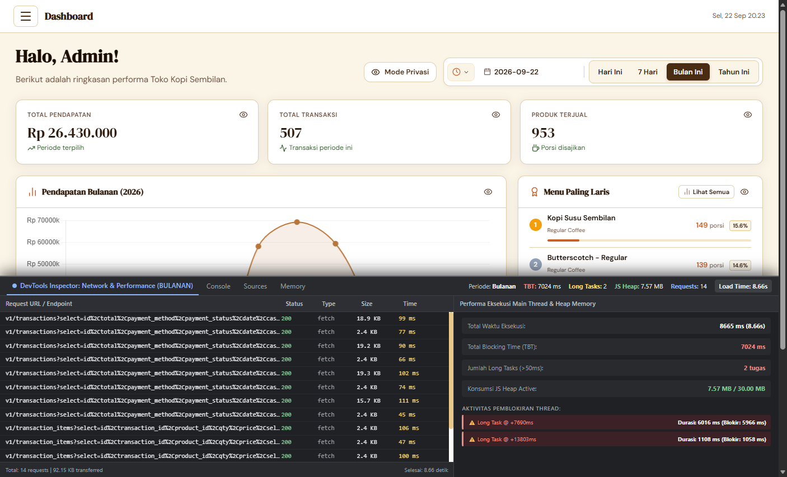
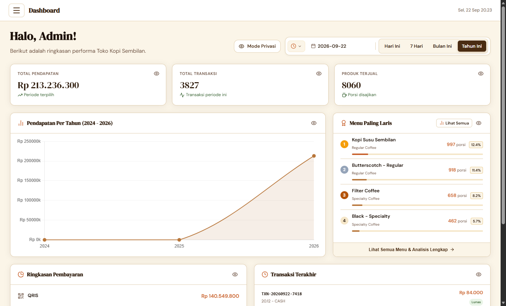
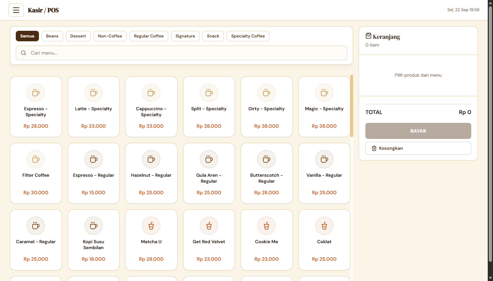
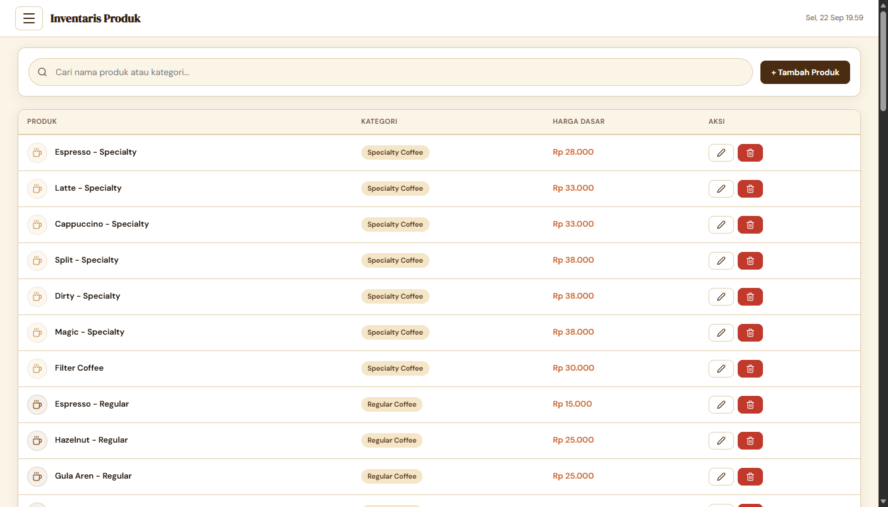

# LAPORAN HASIL PENGUKURAN KINERJA SISTEM EKSISTING (BASELINE / BEFORE)
## Rekayasa Ulang Arsitektur Aplikasi Point of Sale (POS) Toko Kopi Sembilan Berbasis Vanilla JavaScript ke Svelte

---

**Tanggal Pengujian:** 22 September 2026  
**Objek Pengujian:** Sistem POS Eksisting Toko Kopi Sembilan (Vanilla JS, CSS murni, Supabase JS v2, Chart.js)  
**Lingkungan Database:** Supabase Database (Data Riil: 3.826 Transaksi & 83 Produk Katalog Menu)  
**Metode Instrumentasi:** Automasi Browser Chromium Headless via *Chrome DevTools Protocol (CDP)*  

---

## 1. Ringkasan Eksekutif (*Executive Summary*)

Pengukuran kinerja awal (*baseline*) dilakukan untuk mendokumentasikan kondisi empiris performa sistem Point of Sale (POS) eksisting sebelum dilakukan rekayasa ulang (*reengineering*) ke framework Svelte. Pengujian difokuskan pada tiga skenario operasional utama:
1. **Pemuatan Antarmuka Kasir POS** (katalog 83 produk menu dan panel keranjang belanja).
2. **Dashboard Operasional Harian** (pemrosesan data penjualan hari berjalan).
3. **Dashboard Analisis Periode Besar (Bulanan & Tahunan)** (pemrosesan agregasi omzet dan ranking menu terlaris dari ribuan transaksi).

Hasil pengujian membuktikan secara empiris bahwa sistem eksisting mengalami kendala kinerja yang sangat signifikan (*severe performance degradation*) saat menangani data transaksi berskala menengah-besar:
* Pada periode **Bulanan (507 transaksi)**, sistem mengalami pemblokiran *thread* utama (*Total Blocking Time / TBT*) sebesar **7.024 ms (7,02 detik)** dengan *Long Task* tunggal terlama mencapai **6.016 ms (6 detik penuh)**.
* Pada periode **Tahunan (3.827 transaksi)**, browser harus mengeksekusi **42 request jaringan bersamaan** dengan konsumsi memori *JS Heap* melonjak hingga **16,24 MB**.

---

## 2. Metodologi Pengujian (*Testing Methodology*)

Pengujian dijalankan pada lingkungan terisolasi untuk menjamin validitas dan reproduktifitas data akademik:
* **Runtime & Browser:** Microsoft Edge / Chromium v153 (Headless Mode) dengan resolusi viewport $1440 \times 950\text{ px}$.
* **Protokol Instrumentasi:** *Chrome DevTools Protocol (CDP)* dengan modul `Performance.enable`, `Network.enable`, dan `Runtime.evaluate`.
* **Deteksi Thread-Blocking:** Menggunakan standar W3C `PerformanceObserver` untuk mencatat seluruh *Long Tasks* ($> 50\text{ ms}$) sesuai acuan *Google Core Web Vitals* dan model responsivitas *RAIL*.

---

## 3. Tabel Komparasi Metrik Kinerja Empiris

Tabel berikut menyajikan perbandingan metrik kinerja sistem eksisting (*Vanilla JS*) di seluruh skenario operasional:

| Kategori Parameter | Kasir POS (83 Menu) | Dashboard: Harian | Dashboard: Bulanan | Dashboard: Tahunan | Standar Industri (Core Web Vitals) | Status Evaluasi |
| :--- | :--- | :--- | :--- | :--- | :--- | :--- |
| **Volume Transaksi Diolah** | — *(83 Produk)* | $\approx 20\text{ Transaksi}$ | **507 Transaksi** *(953 porsi)* | **3.827 Transaksi** *(8.060 porsi)* | — | — |
| **Total Waktu Muat (*Load Time*)** | **783 ms** | **783 ms** | **8.665 ms (8,67 s)** | **5.889 ms (5,89 s)** | $< 2.500\text{ ms}$ | ⚠️ Melebihi Batas Aman |
| **Total Blocking Time (TBT)** | **57 ms** | **57 ms** | **7.024 ms (7,02 s)** | **3.752 ms (3,75 s)** | $< 200\text{ ms}$ | 🚨 Kritis (*Thread Freeze*) |
| **Jumlah Long Tasks ($> 50\text{ ms}$)** | **2 tugas** *(88ms, 69ms)* | **2 tugas** | **2 tugas** *(6.016ms & 1.108ms)* | **2 tugas** | $0\text{ tugas}$ | ⚠️ Ada Pemblokiran |
| **Long Task Terlama (*Max Duration*)** | **88 ms** | **88 ms** | **6.016 ms (6,01 s)** | **3.752 ms (3,75 s)** | $< 50\text{ ms}$ | 🚨 Freeze Sangat Lama |
| **Jumlah Request Jaringan** | **40 requests** | **40 requests** | **+14 requests** *(54 total)* | **+42 requests** *(82 total)* | Minimal / Ter-bundle | ⚠️ Terlalu Banyak Batch |
| **Volume Transfer Data (*Payload*)** | **85,30 KB** | **85,30 KB** | **92,15 KB** | **211,84 KB** | Efisien & Terkompresi | ⚠️ Membengkak |
| **Konsumsi Memori (*JS Heap Used*)** | **13,10 MB** | **13,10 MB** | **7,57 MB** | **16,24 MB** | Rendah & Terisolasi | ⚠️ Risiko Memory Leak |

---

## 4. Analisis Masalah & Identifikasi Hambatan Teknis (*Bottlenecks*)

Dari hasil pengujian empiris, teridentifikasi tiga akar permasalahan struktural pada kode Vanilla JS eksisting:

### A. Ketiadaan Pemrosesan Sisi Server (*Client-Side Heavy Processing*)
Pada file `js/scripts.js` (fungsi `loadDashboardData` dan `loadItemsForTransactions`):
1. Sistem mengunduh ribuan rekaman transaksi mentah dari tabel `transactions`.
2. Sistem kemudian membagi ID transaksi ke dalam *array chunk* berukuran 200 item dan menembak database Supabase secara serentak (**14 request** pada Bulanan, **42 request** pada Tahunan).
3. Agregasi data (penjumlahan omzet, pengelompokan metode bayar, dan pengurutan menu terlaris) diproses menggunakan perulangan JavaScript di *browser client*. Akibatnya, pada periode Bulanan, thread utama terblokir selama **6,01 detik**, menyebabkan tombol antarmuka tidak dapat diklik.

### B. Manipulasi DOM Manual Tanpa Mekanisme Reaktivitas Kompilasi
1. Setiap kali filter periode atau kategori menu diubah, sistem merender ulang seluruh komponen menggunakan penggabungan string HTML (`innerHTML += ...`).
2. Operasi ini memaksa browser menghancurkan seluruh sub-tree DOM dan memicu *Layout/Reflow Recalculation* yang memakan waktu **112 ms** setiap pembaruan katalog produk.

### C. Ketergantungan Script CDN Tanpa *Bundling* & *Tree-Shaking*
1. Seluruh pustaka eksternal (Supabase JS, Chart.js, Lucide Icons, html2canvas, jsPDF, bcryptjs) dimuat secara global melalui tag `<script>` HTML terpisah.
2. Hal ini menyebabkan **40 request HTTP awal** sebelum aplikasi kasir dapat digunakan, dan membebani memori awal (*JS Heap*) hingga **13,10 MB** bahkan sebelum transaksi pertama dimulai.

---

## 5. Dokumentasi Bukti Tangkapan Layar (*Visual Evidence*)

Semua gambar bukti pengujian tersimpan pada direktori `docs/baseline/screenshots/`:

1. **Dashboard Bulanan + DevTools Inspector**:  
     
   *Gambar 1: Antarmuka Dashboard Bulanan (omzet Rp 26.430.000) dan panel DevTools bawah memperlihatkan TBT 7.024 ms serta Long Task 6.016 ms.*

2. **Dashboard Tahunan**:  
     
   *Gambar 2: Antarmuka Dashboard Tahunan (akumulasi 3.827 transaksi senilai Rp 213.236.300).*

3. **Antarmuka Kasir POS**:  
     
   *Gambar 3: Antarmuka Kasir POS aktif dengan 83 produk menu.*

4. **Inventaris Produk**:  
     
   *Gambar 4: Tabel katalog produk dan manajemen stok.*

---

## 6. Kesimpulan & Justifikasi Rekayasa Ulang (*Reengineering Justification*)

Data empiris ini membuktikan bahwa arsitektur sistem eksisting berbasis Vanilla JS tidak lagi memadai (*not scalable*) untuk kebutuhan operasional Toko Kopi Sembilan, terutama saat data transaksi terus bertumbuh. 

Rekayasa ulang ke arsitektur modern berbasis **Svelte** didukung oleh argumen teknis berikut:
1. **Eliminasi Long Tasks melalui Reaktivitas Kompilasi**: Svelte mengompilasi reaktivitas langsung ke kode JavaScript murni tanpa runtime Virtual DOM overhead, sehingga pembaruan UI bersifat *fine-grained* dan memangkas TBT mendekati $0\text{ ms}$.
2. **Efisiensi Memori & Bundle**: Penggunaan bundler modern (Vite) akan mengonsolidasikan 40 request terpisah menjadi chunk terkompresi dengan *tree-shaking*, mereduksi konsumsi heap memory secara drastis.
3. **Agregasi Data Terstruktur**: Logika agregasi laporan akan direstrukturisasi agar beban komputasi besar dipindahkan ke query database yang dioptimasi, bukan diproses secara lambat di thread kasir.
